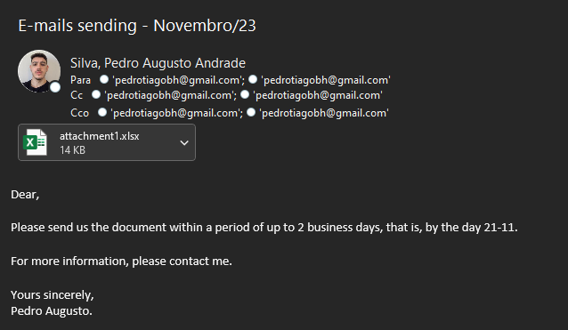

<h1>Outlook Automation</h1>

Outlook automation of e-mail sending with different attachments and recipient list, considering the business days and with a customizable e-mail body.

<h2>Libraries Used</h2>

<strong>They are all available in the requirements.txt archive.</strong>

<ul>
    <li><code>calendar</code>: Information about dates (Python-native).</li>
    <li><code>locale</code>: Region settings - date formating (Python-native).</li>
    <li><code>time</code>: Time settings - measurements and delays (Python-native).</li>
    <li><code>datetime, timedelta, date</code>: Dealing with dates and time intervals (Python-native).</li>
    <li><code>win32com.client</code>: Outlook access to automations.</li>
    <li><code>pandas</code>: Data analysis.</li>
    <li><code>holidays</code>: Worldwide holidays data library.</li>
</ul>

<h2>Initial Settings</h2>

Here we set the initial configurations that will allow us to work with dates in the 
    brazilian format, which is the country I live now. It's also saved in variables
    the name of the attachments and the path of them.

<h2>Functions</h2>

In the third group, we are setting the functions that will make the code work.
    The first function we calculate the delivery time of the e-mail, considering
    the business days, holidays and within 2 working days.

<h2>Execution</h2>

Here, the final part, we make the automation work as it should. The Outlook object
    is defined and a loop is initialized to get all the attachments and recipient list of 
    each group (in our case exist three groups). There is also the complement of the
    e-mail body, which is a .txt file with the informations inside.

<h2>How to run the automation?</h2>

You'll need to download the libraries used, that are in the
    file "requirements.txt".

Create a virtual environment using the code 'virtualenv environment_name' in the 
    terminal. After that, you must run 'pip install -r requirements.txt'. 
    Doing that, all the configurations are now ready to make the automation 
    work as it should.

<h2>Example of e-mail sent on 11/19/2023</h2>

